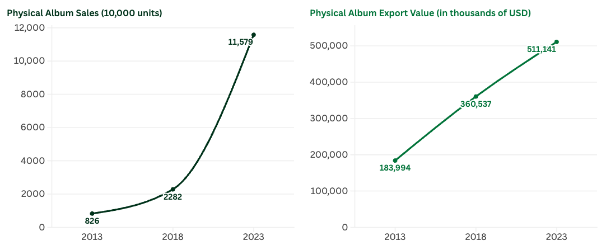
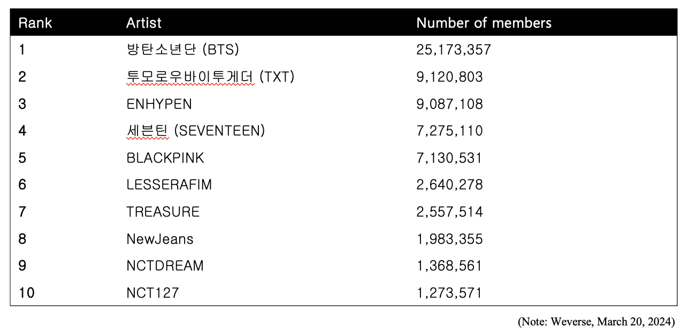
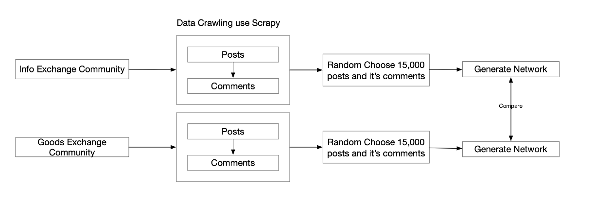
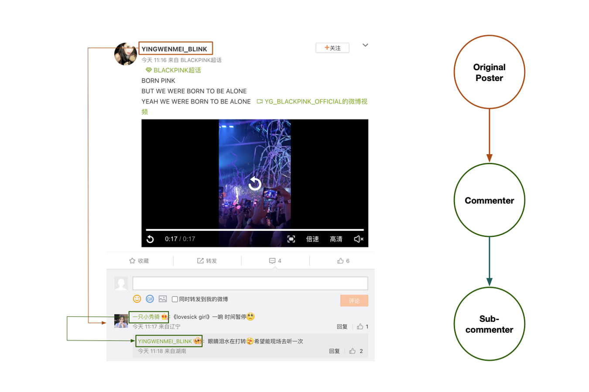
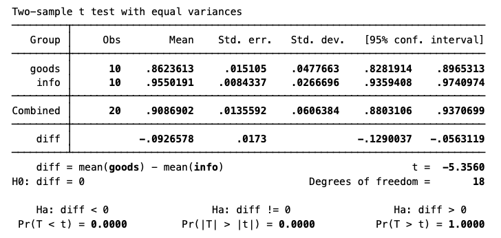
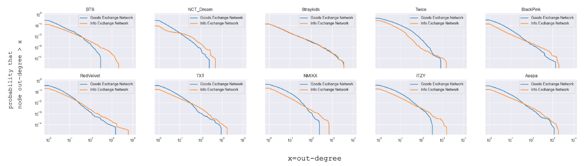
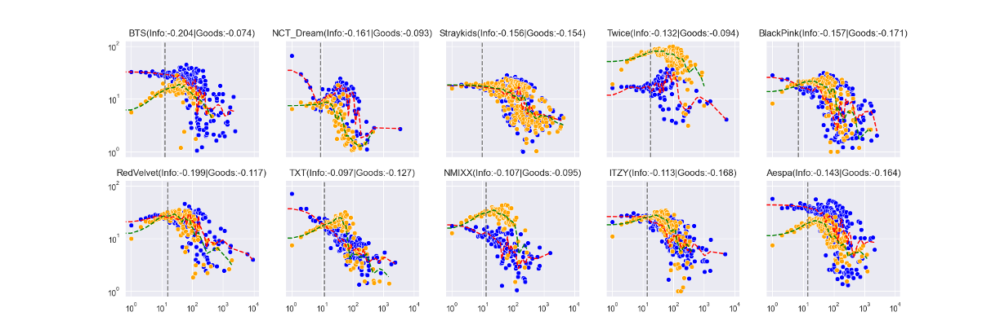

### Why K-POP

#### Why K-pop Fandom and Its Network?

- A new form of solidarity and community (Anderson, 2020; Kim, 2013; Leung, 2012)
- Participatory media fandom as social capital (Lee, 2019, Yeon and Koo, 2024)

### Is K-pop fandom an equal and embracing network?

  <blockquote style="border-left: 4px solid #2962ff; font-family: 'Times New Roman';">
    
"Fans actively participate in the creation and circulation of new content. 
    They are not passive consumers, but rather active participants in the meaning-    making process."
    

     
— Henry Jenkins, Convergence Culture: Where Old  
      and New Media Collide (2006)
      

  </blockquote>
 

  
  <h3>About this Research</h3>
  
  

  

    

      <h4>Social Network Analysis</h4>
      
팬들간의 댓글/대댓글관계의해 팬덤내 소통 네트워크 구축

    

    

      <h4>Social Capital/Exchange Theory</h4>
      
사회자본/교환이론의해 네트워크 특성 해석

    

  

#### Inspired by Social Exchange Theory

<blockquote style="border-left: 4px solid #666; padding: 15px; margin: 20px 0; background-color: #f5f5f5; border-radius: 4px;">
  <ul style="margin: 0; padding-left: 20px; color: #333;">
    <li>Power and Dependence</li>
    <li>Social relationships are formed and maintained through exchanges of valued resources (e.g., information, money, affection).</li>
    <li>Power in a relationship stems from dependence: the more A depends on B for a valued resource, the more power B has over A.</li>
    <li>Dependence is shaped by both the value of the resource and the availability of alternatives.</li>
  </ul>
</blockquote>

#### Processing

#### Network generation

### Network indicators compare
#### Gini-index (out-degree t-test)

  

    Consistent with the power-law distribution characteristics of social networks, both goods and information exchange networks exhibited highly unequal distributions. However, information exchange(0.95) showed a more extremely unequal structure, whereas goods exchange (0.86) was relatively more equal.
  

#### CCDF

  

    In the goods exchange network, a larger proportion of nodes have influence scores in the 1–100 range, and in the >100 high‑influence range both the extreme values and their probabilities are lower. This implies that the goods exchange network exhibits a relatively more equitable distribution of influence than the info exchange network.
  

#### Assortativity

  

    Although both types of networks exhibit disassortativity on the right side of the dashed vertical line (which is consistent with typical social network characteristics), on the left side of the line, the goods exchange network displays assortativity, whereas the info network remains disassortative. This suggests that in the info network, relationships tend to be unbalanced, which is associated with the presence of gatekeeper roles commonly observed in cross-cultural fandom communities. In contrast, the assortativity observed in the goods network among the majority of nodes indicates that fans tend to engage in relatively equal exchanges based on shared topics or interests

  

